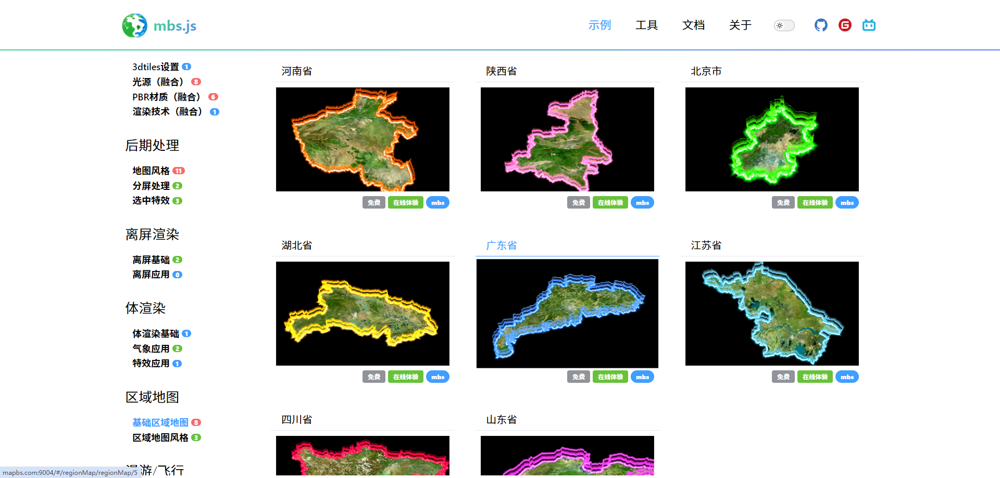

## 🌟 项目名称
> **mbs.js**  
> 基于cesiumjs的web3d框架
> 
> 预览请访问【www.mapbs.com】


---

## 📋 项目简介
**mbs.js** 是一个部分开源项目，旨在提供：
- 🚀 无门槛的实现地理场景下的3d页面
- 🌈 可不用关注图形学基础和gis基础
- 🔒 会持续提供最新的web3d示例

---

## 🔧 功能列表
- ✅ 基础
- 🌐 控件
- 📊 图形元素
- 🚀 场景渲染
- 🌈 后期处理
- ✅ 离屏渲染
- 🌐 体渲染
- 📊 区域地图
- 🚀 漫游/飞行
- 🌈 视效升级探索版
- ✅ 视效升级
- 🌐 星球/宇宙
- 📊 人工智能
---

## 截图





---

## 📦 安装和使用
### 环境要求


### 安装步骤
```bash
# 克隆项目
https://gitee.com/mapbs/mbs.js.git


使用vscode++ 打开项目
使用live server打开一个动态地址直接访问根目录下的index.html

